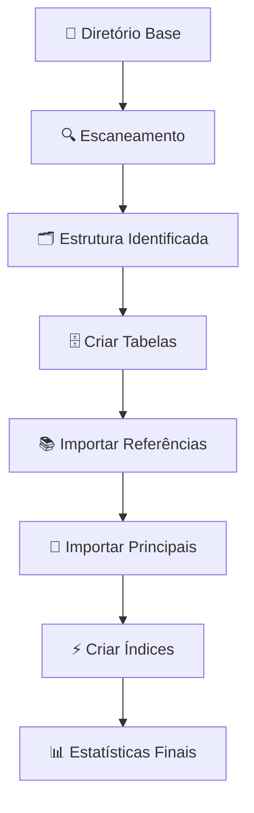

# grandes-geradores-garopaba
Levantamento dos potenciais grandes geradores de resíduos sólidos do município de Garopaba/SC, por meio da base de dados de CNPJ da Receita Federal (Dados Abertos).

# 🇧🇷 Importador CNPJ - Receita Federal

> **Classe Python robusta para importação e consolidação de dados do CNPJ da Receita Federal de múltiplos períodos temporais (2023-05 a 2025-09) em um banco SQLite unificado.**

[](https://python.org)
[](https://pandas.pydata.org)
[](https://sqlite.org)

## 📋 Índice

- [🎯 Características](#-características)
- [🚀 Quick Start](#-quick-start)
- [🏗️ Arquitetura](#️-arquitetura)
- [📥 Estratégia de Importação](#-estratégia-de-importação)
- [🧠 UPSERT Inteligente](#-upsert-inteligente)
- [⚡ Performance](#-performance)
- [🛠️ API Reference](#️-api-reference)
- [🐛 Troubleshooting](#-troubleshooting)
- [📈 Exemplos](#-exemplos)

## 🎯 Características

### ✨ Funcionalidades Principais

| Funcionalidade | Descrição | Benefício |
|---------------|-----------|-----------|
| **🕒 Multi-Período** | Processa pastas 2023-05 a 2025-09 | Dados históricos consolidados |
| **🧠 UPSERT Inteligente** | Não sobrescreve dados bons | Qualidade de dados preservada |
| **⚡ Chunk Processing** | 50.000 registros por lote | Performance e baixo uso de memória |
| **🛡️ Error Handling** | Continua após falhas | Robustez em datasets grandes |
| **🔍 Auto-Discovery** | Identifica arquivos automaticamente | Configuração mínima necessária |

### 📊 Suporte a Tabelas

| Tipo | Tabelas | Descrição |
|------|---------|-----------|
| **📚 Referência** | `cnae`, `municipio`, `natureza_juridica` | Dados de domínio (importados uma vez) |
| **💼 Principais** | `empresa`, `estabelecimento`, `socio` | Dados transacionais (UPSERT inteligente) |

## 🚀 Quick Start

### Instalação

```bash
# Clone o repositório
git clone https://github.com/seu-usuario/importador-cnpj.git
cd importador-cnpj

# Instale as dependências
pip install pandas
```

### Uso Básico
```python
from importador_cnpj import ImportadorCNPJMultiPasta

# Configuração mínima
importador = ImportadorCNPJMultiPasta(
    diretorio_base="receita_federal",
    caminho_db="cnpj_consolidado.db"
)

# Executar importação completa
importador.importar_tudo()
```

### Estrutura de Diretórios
```text
receita_federal/
├── 2023-05/
│   ├── K3241.K03200Y1.D30513.EMPRECSV
│   ├── K3241.K03200Y1.D30513.ESTABELE
│   └── K3241.K03200Y1.D30513.SOCIOCSV
├── 2023-06/
│   ├── K3241.K03200Y2.D30613.EMPRECSV
│   └── ...
├── 2024-01/
└── ...
```

## 🏗️ Arquitetura
### Diagrama de Fluxo


### Schema do Banco
Tabelas de Referência
```sql
CREATE TABLE IF NOT EXISTS cnae (
    codigo VARCHAR(10) PRIMARY KEY,
    descricao TEXT NOT NULL
);

CREATE TABLE IF NOT EXISTS municipio (
    codigo VARCHAR(10) PRIMARY KEY,
    descricao TEXT NOT NULL
);

CREATE TABLE IF NOT EXISTS natureza_juridica (
    codigo VARCHAR(10) PRIMARY KEY,
    descricao TEXT NOT NULL
);

CREATE TABLE IF NOT EXISTS pais (
    codigo VARCHAR(10) PRIMARY KEY,
    descricao TEXT NOT NULL
);

CREATE TABLE IF NOT EXISTS qualificacao_socio (
    codigo VARCHAR(10) PRIMARY KEY,
    descricao TEXT NOT NULL
);

CREATE TABLE IF NOT EXISTS motivo_situacao (
    codigo VARCHAR(10) PRIMARY KEY,
    descricao TEXT NOT NULL
);
```

Tabelas Principais
```sql
CREATE TABLE IF NOT EXISTS empresa (
    cnpj_basico VARCHAR(8) PRIMARY KEY,
    razao_social TEXT NOT NULL,
    natureza_juridica VARCHAR(10),
    qualificacao_responsavel VARCHAR(10),
    capital_social DECIMAL(15,2),
    porte_empresa VARCHAR(2),
    ente_federativo_responsavel TEXT,
    data_atualizacao DATE
);

CREATE TABLE IF NOT EXISTS estabelecimento (
    cnpj_basico VARCHAR(8),
    cnpj_ordem VARCHAR(4),
    cnpj_dv VARCHAR(2),
    identificador_matriz_filial VARCHAR(1),
    nome_fantasia TEXT,
    situacao_cadastral VARCHAR(2),
    data_situacao_cadastral DATE,
    motivo_situacao_cadastral VARCHAR(2),
    nome_cidade_exterior TEXT,
    pais VARCHAR(10),
    data_inicio_atividade DATE,
    cnae_fiscal_principal VARCHAR(10),
    cnae_fiscal_secundaria TEXT,
    tipo_logradouro TEXT,
    logradouro TEXT,
    numero TEXT,
    complemento TEXT,
    bairro TEXT,
    cep VARCHAR(8),
    uf VARCHAR(2),
    municipio VARCHAR(10),
    ddd1 VARCHAR(2),
    telefone1 VARCHAR(9),
    ddd2 VARCHAR(2),
    telefone2 VARCHAR(9),
    ddd_fax VARCHAR(2),
    fax VARCHAR(9),
    email TEXT,
    situacao_especial TEXT,
    data_situacao_especial DATE,
    data_atualizacao DATE,
    PRIMARY KEY (cnpj_basico, cnpj_ordem, cnpj_dv)
);

CREATE TABLE IF NOT EXISTS socio (
    cnpj_basico VARCHAR(8),
    identificador_socio VARCHAR(1),
    nome_socio_razao_social TEXT NOT NULL,
    cpf_cnpj_socio VARCHAR(14),
    qualificacao_socio VARCHAR(10),
    data_entrada_sociedade DATE,
    pais VARCHAR(10),
    representante_legal VARCHAR(11),
    nome_representante_legal TEXT,
    qualificacao_representante_legal VARCHAR(10),
    faixa_etaria VARCHAR(1),
    data_atualizacao DATE
);
```
